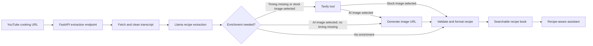

# Agentic Recipe Bookmark

<!-- markdownlint-configure-file {"MD013": {"line_length": 240}} -->

Turn a YouTube cooking video into a structured, searchable recipe.

Agentic Recipe Bookmark extracts a video's transcript, converts it into ingredients and instructions, fills useful gaps, and presents the result in a responsive recipe library.

The app also adds recipe-aware chat, category and ingredient search, favorites, and a choice between AI-generated and stock food imagery.

> **Current status:** This is a local MVP. Extracted recipes live in the browser session, while favorite recipe IDs are saved in local storage.

## Demo

[🎥 Watch the product demo](https://youtu.be/NpRo7iG7E4w)

## Why I built it

Cooking videos are rich in technique, but poor at retrieval. Ingredients and steps are often buried across narration, captions, and timestamps.

I built this project to explore how an agentic workflow can turn that unstructured content into a recipe someone can scan, search, save, and ask questions about while cooking.

The core design separates workflow decisions from the interface: LangGraph coordinates extraction and enrichment, FastAPI exposes clear boundaries, and the browser owns the recipe-book experience.

## From video to recipe

Given a public YouTube cooking URL, the application:

1. Extracts and cleans the video's transcript.
2. Uses a Groq-hosted Llama model to produce structured recipe JSON.
3. Normalizes common model-output issues and validates the recipe shape.
4. Decides whether missing timing data or stock imagery requires web search.
5. Generates an AI food image or selects a stock image, based on the user's choice.
6. Returns a recipe card with metadata, ingredients, and ordered instructions.
7. Grounds follow-up cooking questions in the recipe name, ingredients, and recent chat history.

The agent does not follow one fixed path. It conditionally calls search tools only when the recipe needs enrichment or the user requests stock imagery.

## What works today

| Capability | Current implementation |
| --- | --- |
| YouTube ingestion | Accepts standard watch, short, and embed URLs and retrieves public transcripts |
| Recipe extraction | Produces a name, description, category, timing, servings, difficulty, ingredients, and instructions |
| Agent orchestration | LangGraph state machine routes extraction, parsing, enrichment, image selection, formatting, and errors |
| Selective tool use | Tavily search is requested for missing timing data and stock-image discovery |
| Image choice | Users can choose generated food imagery or a searched stock image |
| Recipe assistant | Answers short questions about substitutions, cooking tips, and modifications using recipe context |
| Discovery | Searches across names, descriptions, ingredients, and categories, with category and favorites filters |
| Responsive UI | Mobile and desktop layouts, keyboard interactions, focus states, and collapsible recipe sections |
| API contracts | FastAPI routes use Pydantic request and response models with generated OpenAPI documentation |
| Observability | LangSmith tracing captures model and workflow activity during local runs |

## Agent workflow

This diagram reflects the workflow implemented in `agent.py` today.



Current responsibilities:

- `RecipeAgent` owns workflow state, routing, model calls, validation, enrichment, and output formatting.
- `tools.py` owns transcript retrieval and Tavily search integrations.
- `app.py` owns HTTP contracts, dependency initialization, error mapping, and recipe chat.
- `static/index.html` owns the responsive interface, local UI state, search, filters, and favorites.

## Engineering decisions

### Structured output before presentation

The model is prompted for a defined JSON shape rather than free-form prose. The workflow cleans common JSON defects, validates known fields with Pydantic, and applies safe display defaults when extraction is incomplete.

### Conditional tools instead of unconditional search

The workflow inspects the parsed recipe and the user's image preference before routing. Search is reserved for missing timing data or stock imagery, reducing unnecessary external calls.

### Recipe context for follow-up chat

The chat endpoint receives the selected recipe's name, ingredients, and recent conversation. This keeps answers focused on the dish instead of operating as an unrelated general chatbot.

### A lightweight frontend for a fast product loop

The interface is served directly by FastAPI and uses browser JavaScript plus Tailwind CSS. That keeps the MVP easy to run while still supporting responsive layouts and rich interactions.

## Technology

| Layer | Technology |
| --- | --- |
| API and contracts | Python, FastAPI, Pydantic, Uvicorn |
| Agent orchestration | LangGraph, LangChain |
| Language model | Groq-hosted Llama 3 8B |
| Transcript source | YouTube Transcript API |
| Search enrichment | Tavily |
| Generated imagery | Pollinations image endpoint |
| Observability | LangSmith |
| Frontend | HTML, browser JavaScript, Tailwind CSS, Font Awesome |
| Client persistence | Browser local storage for favorite IDs |

## Run locally

### 1. Clone the repository

```bash
git clone https://github.com/zer0plus/agentic-recipe-bookmark.git
cd agentic-recipe-bookmark
```

### 2. Create a virtual environment and install dependencies

```bash
python -m venv .venv
source .venv/bin/activate
pip install -r requirements.txt
```

On Windows, activate the environment with `.venv\Scripts\activate`.

### 3. Configure API keys

Create a `.env` file in the repository root:

```dotenv
GROQ_API_KEY=your_groq_api_key
LANGSMITH_API_KEY=your_langsmith_api_key
TAVILY_API_KEY=your_tavily_api_key
```

Groq powers recipe extraction and chat. Tavily enriches missing data and searches for stock images. LangSmith records agent traces for inspection.

If YouTube transcript access requires a proxy in your environment, the app also reads `PROXY_HOST`, `PROXY_PORT`, `PROXY_USERNAME`, and `PROXY_PASSWORD`.

### 4. Start the application

```bash
python app.py
```

Open [http://localhost:8000](http://localhost:8000) for the app or [http://localhost:8000/docs](http://localhost:8000/docs) for the generated API documentation.

## API surface

| Method | Route | Purpose |
| --- | --- | --- |
| `GET` | `/` | Serves the recipe-book interface |
| `POST` | `/api/extract-recipe` | Extracts and enriches a recipe from a YouTube URL |
| `POST` | `/api/recipe-chat` | Answers a short question using the selected recipe and chat history |

## Repository guide

```text
app.py             FastAPI application, HTTP contracts, and recipe chat
agent.py           LangGraph recipe-extraction and enrichment workflow
tools.py           YouTube transcript and Tavily search tools
static/index.html  Responsive recipe-book interface and browser state
langgraph.json     LangGraph Studio graph configuration
requirements.txt   Python dependencies
```

## Current MVP scope

- The app requires a YouTube video with an accessible transcript.
- Extracted recipes are held in browser memory and reset when the page reloads.
- Favorite IDs persist in local storage on the current browser only.
- The seeded recipes are interface examples, not records in a database.
- There is no user authentication or server-side recipe library yet.
- Recipe and image quality depends on the transcript and external model, search, and image services.
